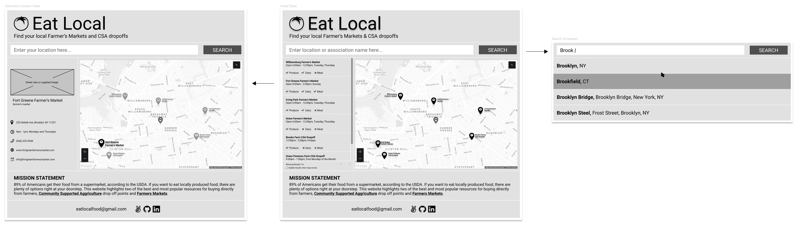

# EatLocal
  
> "About 89% percent of households do their primary grocery shopping at supermarkets or supercenters."  

-[USDA Economic Research Service, March 2015](https://www.rootcausecoalition.org/wp-content/uploads/2016/06/Food-Acquisition-and-Purchase-Survey.pdf)  
  
Most Americans, especially those who live in highly populated areas, have access to farmers markets and CSAs. If they had a centralized resource for discovering these local resources, they can eat better while supporting sustainable agricultural practices. Eat Local aims to help solve this problem by providing a map of all the local farmer's markets and CSAs.  

#

### Functionality & MVP  
  
Eat Local will allow users to:

- Browse a map of all CSAs and Farmers Markets in the country
- A search bar to enter their location
- View the CSAs and Farmers Markets as pins on the map and in a list
- Filter the results based on when they are open and what kind of food they sell
- Click on a pin or list item to see more details
  
Additionally the project will include:

- Geo-locator that sets map to nearby location by default
- A production readme
  
#
  
### Architecture & Tech
  
*Frontend Stack:*  
- Environment - Node.js
- Bundler - Webpack
- Map, Geolocation, Places - Google Maps API
- Primary Data - USDA National Farmers Market Directory API
- Supplemental Data - Scraper API (bonus)
- Design inspiration - IBM Carbon
- DOM manipulation & api calls (initially) - jquery

*Backend Stack*
- API server framework - Express
- DB Querying language - GraphQL
- DB toolkit - Prisma (ORM alternative)
- DB - PostgreSQL
- Hosting - Heroku

  
*Frontend Structure:*  
- index.html will include empty divs for the searchbar, map, and KML overlay
- index.js entry file
- map.js google maps react component that includes sidebar as a KML overlay and built in SearchBar element.
- api_utils.js includes API calls to fetch data and returns promise

*Backend Structure*
- index.js - sets up graphQL schema and GraphQL server on express using the graphql-yoga package
- prisma.yml - config file for prisma
- schema.prisma acts as an all-in-one schema, model, and migration file.
- gql.js - structures response json (need corresponding file on frontend)

#

### Timeline

*Day 1:* integrate google maps API

- When entering the website it shows you a map with your current location
- You can enter an address in the search bar and it will move the map to that location
- Address autocomplete options are rendered in a dropdown menu

*Day 2:* Database API integration with google maps

- Based on the location, google maps will now also render nearby farmer's markets
- Changing your location or moving the map will trigger another db query
- Clicking on a pin opens the sidebar menu which displays additional info about db record (farmer's market)

*Day 3:* Scraper API for additional data

- Setup the scraper API to draw additional data for the map from the USDA databases (that don't have an API)
- Finalize the styling and debug

*Day 4:* Backend setup

- Can make graphQL queries of api
- Server runs scrapers on a weekly basis to keep records up to date

*Day 5:* Frontend Features

- Form for requesting another location be added to the DB, this will be queued by posting to the DB with a "pending" status.
- Menu hamburger that opens modal nav w/mission statement, new location form, contact info

Bonus Features

- Scrape aggregator sites with non-normalized data, in particular localharvest.org
- Build a web crawler that can continue the search for new and unlisted CSAs/local markets!
- Query google maps places for farmers markets and csas, but this requires some really smart filtering to avoid false positives.
- Automatically review new location post requests to ensure they are relevant, instead of relying on manual confirmations.

#

### Wireframe

